# Link to Web-App
https://www.michaelwoodruffdev.com/

# A Short Introduction
We are Los Animales and our members are Dylan Bunch, Chase Alexander, and Michael Woodruff. We are making a rapid-fire trivia game called Triv.io (we currently do not own this domain, but that could be a future addition). All 3 of us worked on the UI at some point, but Dylan was mostly responsible for making Triv.io into something pretty using Vue Material design. Chase and Michael primarily worked on the Node backend, the web-sockets for matchmaking. Michael also worked with JWT for account authentication.
When you enter the website, you'll see two panels on the login page. The left panel is a short description of the web-app and the right is where you can login to the website. If you do not have an account, you can click the "Create Account" button at the bottom of the login panel. Then the login panel changes into the create account panel, and you can enter in your desired credentials. If you choose to create an account with a username that is taken, an error message will appear to notify you as such. The same can be said about passwords that do not match in both fields.
Upon logging in, you are presented with a navbar, 3 tiles, and the profile, friends, and logout button. The Navbar allows easy navigation between the game page, the leaderboards page, and the about page. On the game lobby page you will find the aforementioned 3 tiles: one that says "Create Game", one that says "Join Friend", and one that says "Join Game". If  you click "Create Game", a dialog box will appear and direct you to select the difficulty of the questions, the category in which to pull from, and the number of questions in the round. If you click "Join Game" you will be presented with a dialog box prompting you to choose the game you want to join. If you click "Join Friend" you'll be prompted to join one of your friends' open games.
The leaderboards page is where you can find the top-scoring players in a tabled form with all their game statistics on display. On the about page you will find information regarding the website, how it was built, and who did what in the project.

Note: <strong>You must be signed in as two different users to be able to play a game, so we recommend playing on two different devices</strong>.

  
# The Problem
Create a fast-paced trivia experience with an application

  
# Our Solution
Triv.io is a web application that features short matches with questions pulled from opentdb.com, an open api to recieve trivia questions. Triv.io features random matchmaking and playing with friends.

  
# Implementation
## Backend (Michael, Chase)
__NodeJS__
- run server and host static resources 

- /backend/server.js

__ExpressJS__
- useful library for NodeJS servers to help with routing, and including middleware 

- /backend/server.js, /backend/api-routes.js

__Socket.io__
- a library for managing multi-threaded websocket connections 

- /backend/server.js

__MongoDB__
- Database to hold user and match history data

__Mongoose__
- Useful npm library to help with connected to MongoDB

- /backend/api-routes.js

__bcrypt__
- library for hashing passwords and comparing hashed passwords

- /backend/api-routes.js

__JSON Web Tokens__
- for session and token (authentication) management

- /backend/api-routes.js

  
## Frontend (Dylan, Michael, Chase)
__Vue__ 
- a component-based frontend web framework for organizing applications

__Vue Material__ 
- a plugin for vue that offers material design components

__Vue Router__ 
- manages routes for Vue application

__Vuex__ global 
- state management for Vue application (JWT was kept here)

__Local Storage__ 
- caches authentication token

__Socket.io__ 
- manages websocket between client and host

<!-- We'll be usinf NodeJS to set up our server, Vue for a frontend framework, MongoDB to manage user data, the open api to pull trivia questions, web-sockets to manage connections to games, and Vue Material to style everything. Chase and Michael handled mongodb, web-sockets, and the TDB api. Dylan handled the Vue Material frontend. -->

   
# Where We Meet Requirements
__Consistent Design and User Experience__
- in /frontend/src/components there are components, such as the profile tab and the nav bar, that are reused between different routes and within other components
- We used material design where it made sense to keep consistent look
- Dynamic content can be found in several components/views. LeaderboardsPage.vue, ProfileTab.vue, GamePage.vue all have dynamic content
- Most (hopefully all) bugs are worked out so users will have a consistent experience

__Well-Structured__
- ‘code/backend/model’ contains models for data housed in the MongoDB
- ‘code/backend/api-routes.js’ contains node/express endpoints for frontend to hit
- ‘code/backend/server.js’ contains logic for web sockets and serving static resources
- ‘code/frontend/src’ contains views and controllers for components of the application
- This organization made it pretty clear where to look to change something, and made many pieces of code reusable

__Authentication__
- Passwords are hashed and stored in the database, plain text passwords are not used in the database
- Passwords are hashed on the server-side when comparing to hashed passwords within the database
- JSON Web Tokens are used to maintain sessions
- This JSON Web Token is stored in the Vuex (global data for Vue applications), after logging in.
- Our Vue application router has a function called before every route switch which checks localStorage for a JWT if one isn't within Vuex, and verifies the token in Vuex or localStorage against an endpoint on our server
- Users can logout by clicking the door icon on top right of page
- Places to find authentication logic would be 
  - code/frontend/src/router/index.js, The beforeEach function
  - code/backend/api-routes.js, Signin and verifySignin endpoints
  - code/frontend/src/components/PageNav.vue, Logout functionality

__Architecture__
- Model: The model is the MongoDB which resides server-side. Templates for data stored there can be found in code/backend/model
- Controller: Logic for individual components are housed in the script tag in the respective Vue Component. Whenever these components need to access the model (make a call to the api endpoint), it must go through a controller defined in code/frontend/src/controllers/
- View: Views are housed in the template tag in each respective Vue file.

__Persistent__
- User data and their match histories are stored in a Mongo Database server-side (persistent)
- LocalStorage is used for holding onto authentication tokens in case a user closes their tab and wants to reopen the webpage and be logged in already.
- Persistence is implemented inside the model/user.js file using mongoose and MongoDB.

__Security__
- The site is secure since every request sent must be validated with a JWT generated on login. You can see their use in the functions on lines 109 and 143 of LoginPage.vue.
- User input that involves DB operations are tested using a regular expression located in the ValidationController.

__Responsive__
- We used material design with nearly every element we could. Can be found in the LoginPage.vue under the template section.
- Media queries in the css are used to make sure each page is responsive
- When the page width hits a certain threshold (we checked for 600 or 700px depending on page), new css will be applied to ensure mobile support

__Content__
- We have data, in fact we pull all of our trivia from TDB, a trivia database of user-submitted questions. Can be found within the server.js file in backend.
- User content is stored on the Mongo DB
- Question content is received on the fly from [this](https://opentdb.com/api_config.php) api
- Initial User Data is the following
  - Username: michael, Password: testing
  - Username: zion chilliamson, Password: testing
  - Username: chase, Password: testing
  - Username: Dylan, Password: testing

__Error Handling__
- If you log-in with an incorrect password or username, a message will be displayed informing you as such. 
- If you register with a taken username or if the passwords do not match, a message will display informing you as such. 
- When creating a game, a dialog will appear with several dropdowns. while any of the fields are unfilled, the create button will be disabled. (LobbyEntryPage.vue and LoginPage.vue)
- consistently styled messages will appear throughout the application informing the user about web socket information (User left the match, User is not hosting a match, No games found, etc)

__Publicly Viewable__
- the application is hosted on the domain 'michaelwoodruffdev.com'

__Overall Purpose__
- Our purpose was to make a fun, fast paced trivia game
- I think that in the future, we should implement rematches in the lobby system, this would help with the flow of the game and match our purpose more
- In trying to meet the purpose of our application, we learned a lot about web sockets, authentication, node servers, and component-based web frameworks in general

# Knowledge Gained
Since Dylan didn't know Vue and he worked on the front-end, he learned how to use that framework. Michael and Chase got more experience with web-sockets, Vue, Node, and MongoDB since they worked on the backend. We also learned that it can be hard to manage the project with only 2 branches (frontend and backend). Instead, a branch per group member keeps toes from being stepped on until merges, but merges are where toes get stepped on anyway. We also learned that communication is imperative as we lost hours of work when Dylan designed an Angular frontend but, because of bad communication on everyone's part, we ended up having to ditch the Angular frontend since Chase and Michael needed a frontend to test with and Dylan had not finished yet, so they made a Vue frontend instead.

# Future Work
What we need to finish before the due date is a login page and the functionality behind it, a create account functionality, the game lobby page, the game page, the leaderboards page, and the about page. We need buttons so navigation on the page is easy, as well as a button to log out when you're done with the game. 

# Screenshots
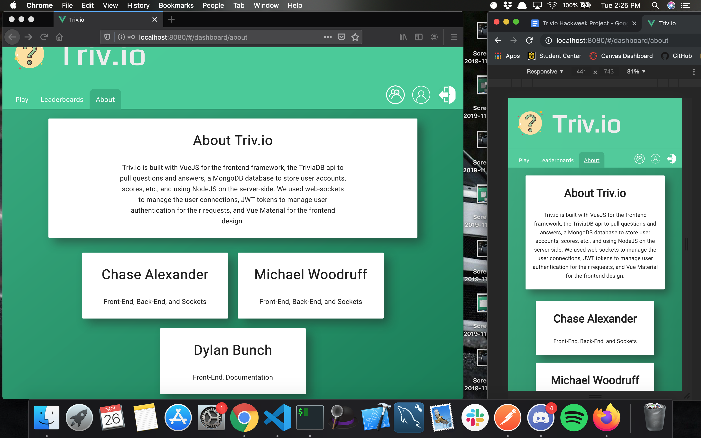
The about page; where you can find information about the project and the team-members.
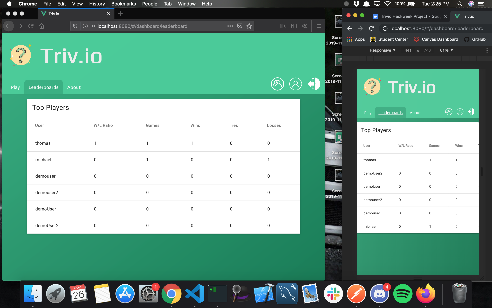
The leaderboards where you can see the top scores.
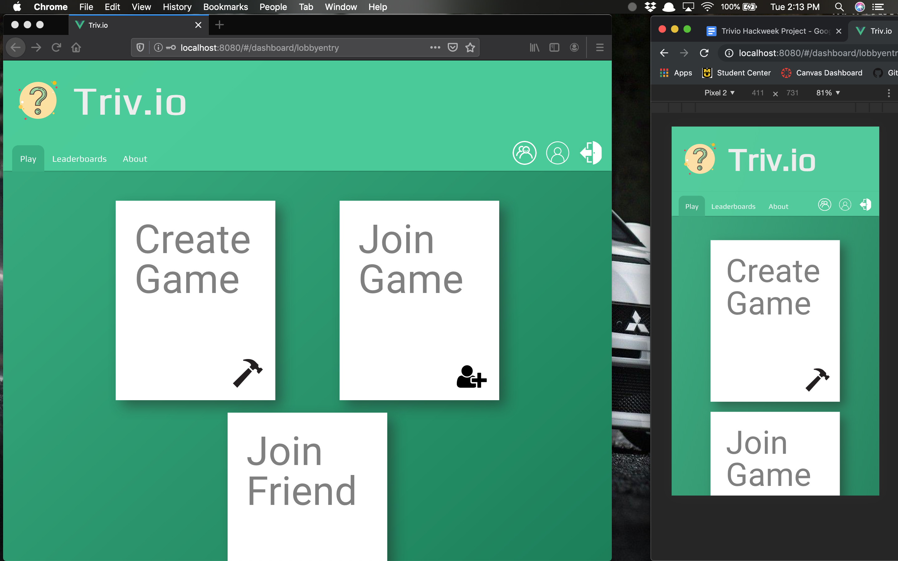
The game lobby page where you can choose how to enter a new or existing game.
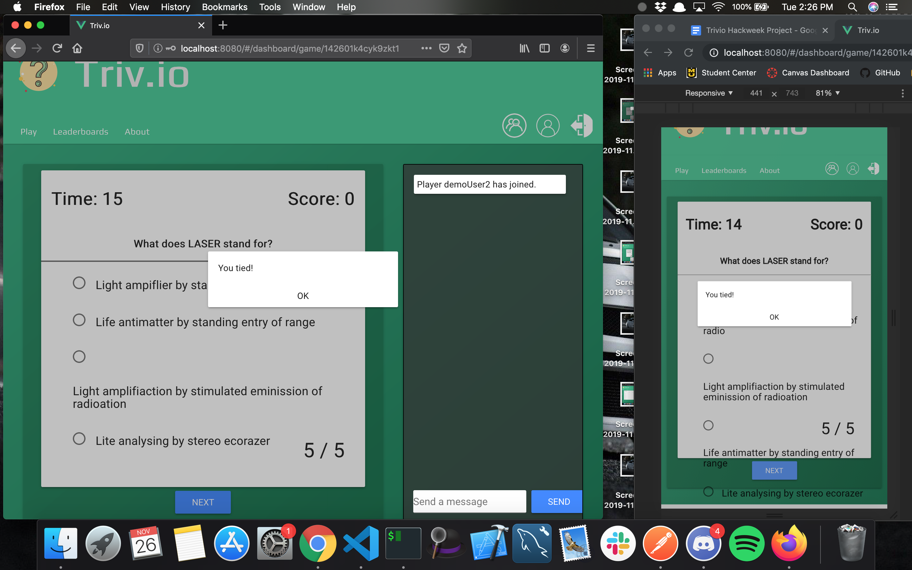
The end of the game page; displays after a game of Triv.io is finished.
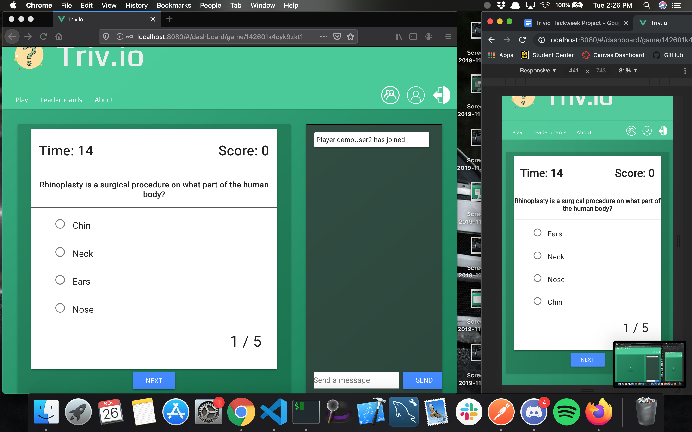
The in-game page; displays while inside the game; where you answer questions and receive scores.
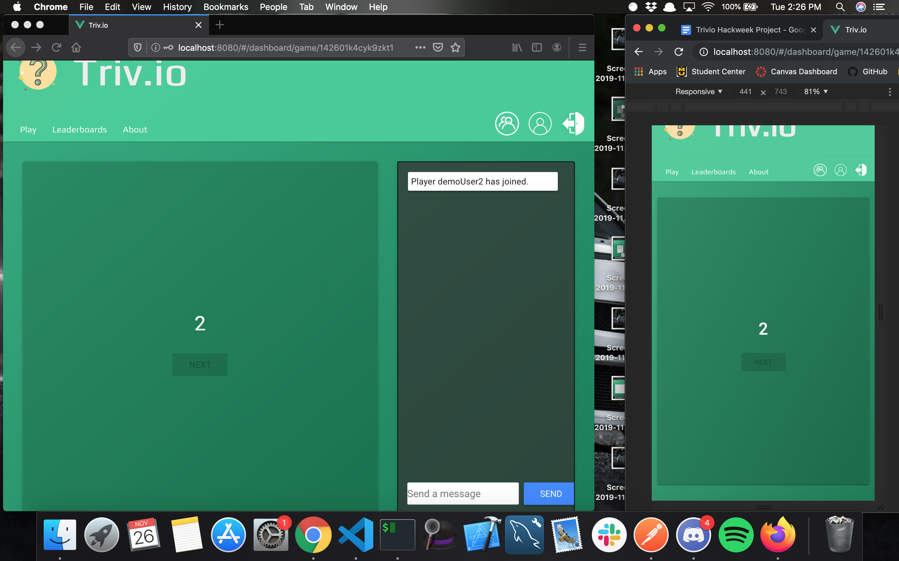
The pre-game page; displays after starting a game, but before answering questions.
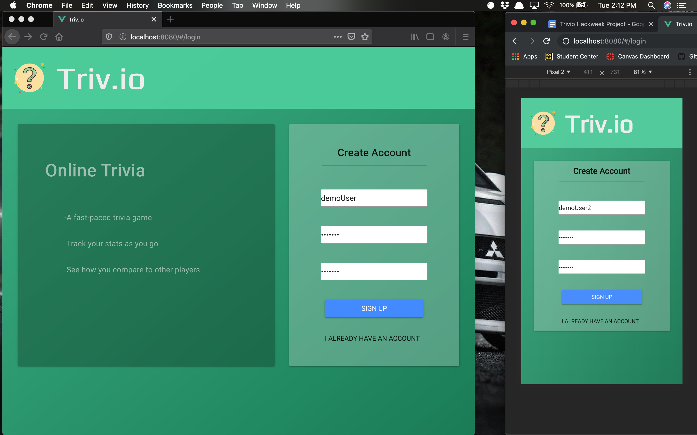
The create-account page; shared with login page.
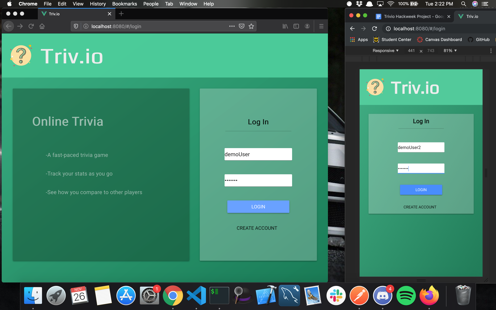
The login page; shared with create account page.
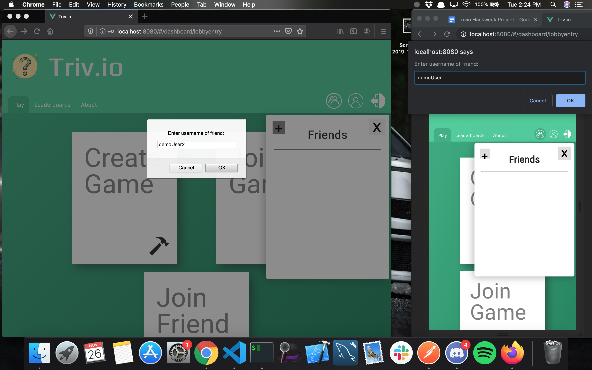
The add friend dialog; dialog box that appears so you can add to your friends list.
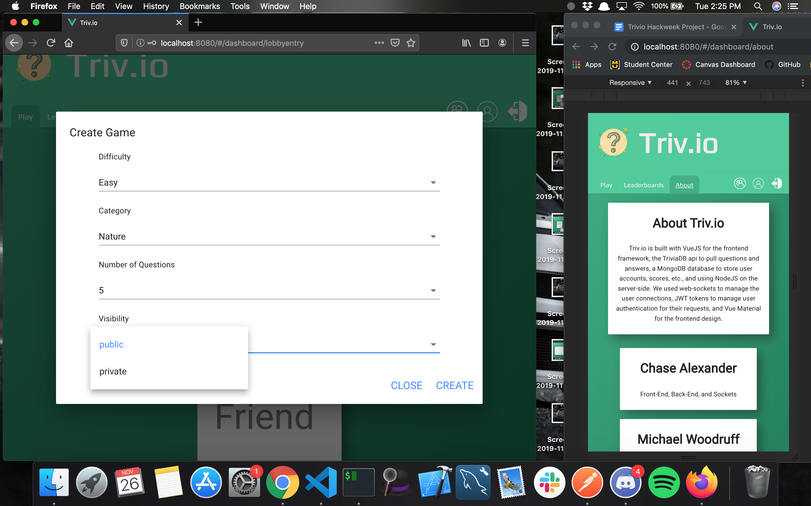
The create game dialog; dialog that manages settings for a new game.

The friends dialog; manages your friends list.
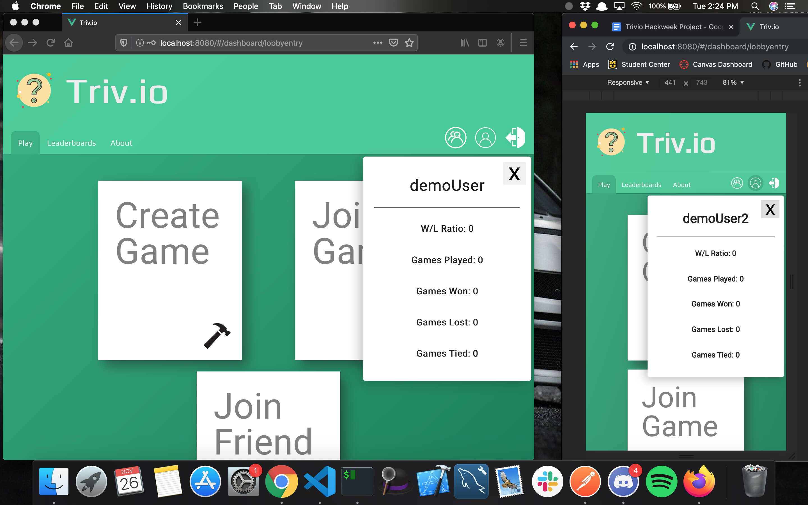
The profile dialog; user profile where stats can be shown.
